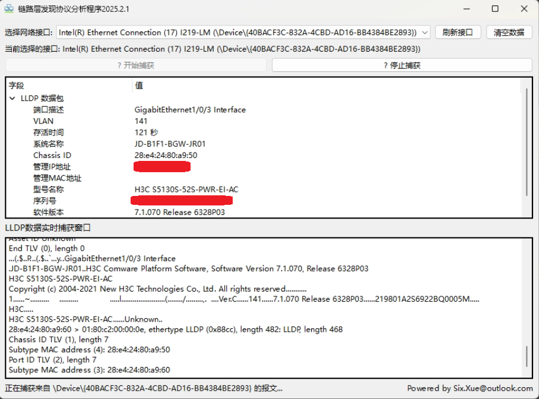

#                链路层发现协议分析程序
## 一个用Python写的用于捕获网卡的报文信息并过滤分析报文内容。
  实现方式：
  
        *1、通过调用tcpdump.exe-参数来获取只指定网卡的报文。
        
        *2、用python分析报文，通过正则表达式过滤指定的数值。
        
        *3、读取到的数值存储到列表中，并实时更新获取到的的数值。
        
##  展示

      主界面

          
          
      报文捕获数据界面
          

          
